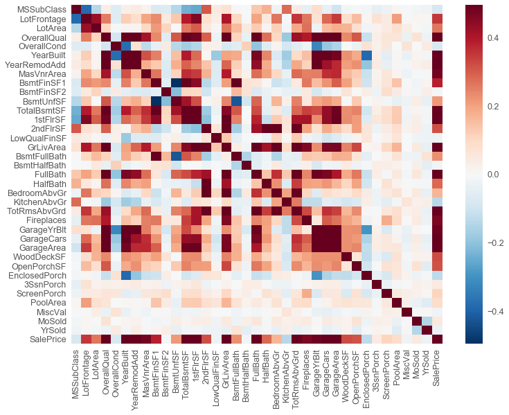

```python
##House Prices: Advanced Regression Techniques Test 
##Author: Nok Chan 
##Last modified: 8/13/2017
```


```python
%config IPCompleter.greedy=True
import numpy as np
import pandas as pd
import matplotlib.pyplot as plt
import seaborn as sns

from sklearn import ensemble, tree, linear_model
from sklearn.preprocessing import Imputer
from sklearn.feature_selection import SelectKBest
from sklearn.decomposition import PCA
#pd.DataFrame(result_pd_RF).to_csv('resultRF.csv',index = False)
from sklearn.pipeline import Pipeline
from sklearn.preprocessing import  MinMaxScaler
from sklearn.model_selection import GridSearchCV
from sklearn.model_selection import RandomizedSearchCV
import os
%matplotlib inline 
import pylab 
import scipy.stats as stats
plt.style.use('ggplot')
#This line force the graph print out in this jupyter Notebook


```


```python
from sklearn.cross_validation import train_test_split, cross_val_score
from sklearn.metrics import r2_score, mean_squared_error
from sklearn.utils import shuffle
```


```python

testset = pd.read_csv('test.csv')
trainset = pd.read_csv('train.csv')
```


```python
trainset.isnull().sum()
## Some features have almost all null in every rows, so I will remove null> 1000 for cleaning the features a little bit.

```


    Id                  0
    MSSubClass          0
    MSZoning            0
    LotFrontage       259
    LotArea             0
    Street              0
    Alley            1369
    LotShape            0
    LandContour         0
    Utilities           0
    LotConfig           0
    LandSlope           0
    Neighborhood        0
    Condition1          0
    Condition2          0
    BldgType            0
    HouseStyle          0
    OverallQual         0
    OverallCond         0
    YearBuilt           0
    YearRemodAdd        0
    RoofStyle           0
    RoofMatl            0
    Exterior1st         0
    Exterior2nd         0
    MasVnrType          8
    MasVnrArea          8
    ExterQual           0
    ExterCond           0
    Foundation          0
                     ... 
    BedroomAbvGr        0
    KitchenAbvGr        0
    KitchenQual         0
    TotRmsAbvGrd        0
    Functional          0
    Fireplaces          0
    FireplaceQu       690
    GarageType         81
    GarageYrBlt        81
    GarageFinish       81
    GarageCars          0
    GarageArea          0
    GarageQual         81
    GarageCond         81
    PavedDrive          0
    WoodDeckSF          0
    OpenPorchSF         0
    EnclosedPorch       0
    3SsnPorch           0
    ScreenPorch         0
    PoolArea            0
    PoolQC           1453
    Fence            1179
    MiscFeature      1406
    MiscVal             0
    MoSold              0
    YrSold              0
    SaleType            0
    SaleCondition       0
    SalePrice           0
    Length: 81, dtype: int64


```python
features = trainset.columns.values
remove_features = trainset.columns[trainset.isnull().sum()>1000]

```


```python
print(testset.shape)
print(trainset.shape)
```

    (1459, 80)
    (1460, 81)
    


```python
trainset = trainset.drop(remove_features,1)
trainset = trainset.drop('Id', 1)

```


```python
testset = testset.drop(remove_features,1)
testset_id = testset['Id']
testset = testset.drop('Id', 1)
```


```python
remove_features
```


    Index(['Alley', 'PoolQC', 'Fence', 'MiscFeature'], dtype='object')


```python
print(testset.shape)
print(trainset.shape)
```

    (1459, 75)
    (1460, 76)
    


```python
## For now, i will start with the numerical variable and ignore the categorial variables for a while
## Start with correlation always give you some insights about how different factor related.
## Since the number of variables is large, it's not easy to visualize with table, a matrix could help us on this.
## Seaborn library-
train_cor = trainset.corr()
plt.subplots(figsize=(12, 9))
sns.heatmap(train_cor,vmax=0.1)
```


    <matplotlib.axes._subplots.AxesSubplot at 0x11ab2ac8>





```python
## From the heatmap we can see some variable has correlation very close to 0.8
## Grage YrBlt,GarageCars,Garage Area are strongly correlated, we don't want this collinearity as Area of Garage 
##is limiting factor of how many car u can park.

## TotalBsmtSF and ,1stFlrSF  is also highly correlated, see the metadata.
##     1stFlrSF: First Floor square feet
## TotalBsmtSF: Total square feet of basement area

## YearBLT is also highly correlated to GarageYearBLT
## OverallQuality has a strong correlation with Sales Price too, this is good as this is a useful indicator for predicting 
## sales price which is our ultimate goal.


```


```python
## To decide which factor we should keep, I will keep the factor that are more correlated to sales price as I think this
## will help the performence of the model.

#saleprice correlation matrix
k = 10 #number of variables for heatmap
cols = train_cor.nlargest(k, 'SalePrice')['SalePrice'].index
cm = np.corrcoef(trainset[cols].values.T)
sns.set(font_scale=1.25)


hm = sns.heatmap(cm,cmap="RdBu_r", yticklabels=cols.values, xticklabels=cols.values)

## The order of the features is already sorted in descending order.


```


```python
## GarageCars has a higher correlation, so Garage Area and GarageYearBlt will be dropped.
## TotalBsmtSF has a higher correlation with 1stFlrSF, so it will be dropped as well.
trainset = trainset.drop(['1stFlrSF','GarageArea','GarageYrBlt'],1)
testset = testset.drop(['1stFlrSF','GarageArea','GarageYrBlt'],1)
```


```python
print(trainset.shape)
print(testset.shape)
## Ok , 3 mores columns dropped
```

    (1460, 73)
    (1459, 72)
    


```python
## So some more EPA about our target variable -- Sales Price

sns.distplot(trainset['SalePrice'])


## The data looks quite good, money is always appear in a skewed distribution in normal scale, we can normalized it in a log scale.

```


    <matplotlib.axes._subplots.AxesSubplot at 0x562f940>


```python
sns.distplot(np.log(trainset['SalePrice']))

## Voila, it is very close to normal distrubtion.
## Therefore, it is good to apply log transformation to SalePrice variable as regression usually need a normal distribution error assumption

trainset['SalePrice'] =np.log(trainset['SalePrice'])
```


```python
train_labels = trainset['SalePrice']
trainset = trainset.drop('SalePrice',1)

```


```python
from sklearn.model_selection import train_test_split
testset_index = range(len(trainset),len(trainset) + len(testset))

trainset_index, validset_index = train_test_split(range(len(trainset)),
                                    random_state = 42 , test_size = 0.3)

```


```python
print(len(trainset_index), len(validset_index))
```

    1022 438
    


```python
masterset = pd.concat([trainset,testset], axis = 0)
```


```python
masterset.shape
```


    (2919, 72)


```python
masterset_backup = masterset
# Getting Dummies from all other categorical vars
for col in masterset.dtypes[masterset.dtypes == 'object'].index:
    for_dummy = masterset.pop(col)
    masterset = pd.concat([masterset, pd.get_dummies(for_dummy, prefix=col)], axis=1)
```


```python
masterset.shape
```


    (2919, 272)


```python
train_labels_full = train_labels
train_features_full = masterset.iloc[range(len(trainset))]
```


```python
train_features = masterset.iloc[trainset_index] 
test_features = masterset.iloc[testset_index]
valid_features = masterset.iloc[validset_index]

## Take a copy of it will be a reference of train_labels
valid_labels = train_labels[validset_index].copy() 

train_labels = train_labels[trainset_index]
```


```python
print(train_features.shape)
print(test_features.shape)
```

    (1022, 272)
    (1459, 272)
    


```python
from sklearn.metrics import mean_squared_error

def plot(actual, predict, title):
    plt.figure(figsize=(8, 4))
    plt.scatter(actual, predict, s=20, c='steelblue')
    plt.title('Predicted vs. Actual '+ title)
    plt.xlabel('Actual Sale Price')
    plt.ylabel('Predicted Sale Price')

    plt.plot([min(actual), max(actual)], [min(actual), max(actual)],c ='red')
    plt.tight_layout()
    
def error_plot(actual, predict, title):
    fig = plt.figure(figsize=(8, 4))
    ax1 = fig.add_subplot(1,2,1)
    
    plt.scatter(range(1,len(actual) + 1),actual-predict, s=20)
    plt.title('Sales Price Error '+ title)    
    plt.ylabel('Sales Price Error(log Actual - log Predict)')
    ax2 = fig.add_subplot(1,2,2)
    stats.probplot(actual - predict, dist="norm", plot=pylab)
    pylab.show()

    
    
    
def summary(model,train_features, train_labels, valid_features, valid_labels):
    ## Because I have done log transform to the labels already, so we use mean squared error here
    ## is actually mean suqared log error
    train_predicts = model.predict(train_features)
    valid_predicts = model.predict(valid_features)
    print('Cross Val (Train set)', np.sqrt(-cross_val_score(model, train_features, train_labels,
                scoring = 'neg_mean_squared_error')))
    print('Cross Val (valid set)',np.sqrt(-cross_val_score(model, valid_features, valid_labels,
                      scoring = 'neg_mean_squared_error')))
    print('Accuracy Val(Train set)', model.score(train_features, train_labels))
    print('Accuracy Val (Valid set)',model.score(valid_features, valid_labels))
    print('Roo tMean Squarted Log Error (Train set): ', mean_squared_error(train_labels,
                                                    train_predicts)**0.5)
    print('Root Mean Squarted Log Error (Valid set): ', mean_squared_error(train_labels,
                                                    train_predicts)**0.5)
    
    ## Graph Actual vs Predict
    plot(train_labels, train_predicts, 'Training Set')
    plot(valid_labels, valid_predicts, 'Validating Set')
    
    ## Error Plot
    error_plot(train_labels, train_predicts, 'Training Set')
    error_plot(valid_labels, valid_predicts, 'Validating Set')
    
   
   
```

## Gradient Boosting


```python
## Model
GBest = ensemble.GradientBoostingRegressor( max_features='sqrt',
                                           min_samples_leaf=15, min_samples_split=10,
                                           loss='huber',
                                           random_state = 42)
PipeGB = Pipeline([
        ('imp', Imputer(missing_values='NaN')),
        ('std', MinMaxScaler()),
        ('selection', SelectKBest()),
        ('pca', PCA()),
        ('boost', GBest)
    ])
# estimator parameters
kfeatures = [32,64,128,256]
components = [4,8,16,32]
estimators = [256,512,1024]
learnrate = [0.001,0.01,0.1,1]
depth = [3,6,9]

param_grid_GB={'selection__k': kfeatures,
              'pca__n_components': components,
              'imp__strategy': ['mean','median'],
                'imp__missing_values': ['NaN'],
              'boost__n_estimators': estimators,
              'boost__learning_rate':  learnrate,
            'boost__max_depth' : depth
               }
```


```python
# set model parameters to grid search object
gridCV_GB = RandomizedSearchCV(estimator = PipeGB, 
                             param_distributions = param_grid_GB,
                             n_iter = 5,
                             scoring = 'neg_mean_squared_log_error',
                             cv = 5)

        
# train the model
gridCV_GB.fit(train_features, train_labels)

print(gridCV_GB.best_params_)

```

    C:\Users\noklam.chan\AppData\Local\Continuum\Anaconda3\lib\site-packages\sklearn\feature_selection\univariate_selection.py:113: UserWarning: Features [ 95  98  99 121 134 151 169 183 201 210 217 259 264] are constant.
      UserWarning)
    C:\Users\noklam.chan\AppData\Local\Continuum\Anaconda3\lib\site-packages\sklearn\feature_selection\univariate_selection.py:114: RuntimeWarning: divide by zero encountered in true_divide
      f = msb / msw
    C:\Users\noklam.chan\AppData\Local\Continuum\Anaconda3\lib\site-packages\sklearn\feature_selection\univariate_selection.py:114: RuntimeWarning: invalid value encountered in true_divide
      f = msb / msw
    C:\Users\noklam.chan\AppData\Local\Continuum\Anaconda3\lib\site-packages\sklearn\feature_selection\univariate_selection.py:113: UserWarning: Features [ 48  49  95  97  98  99 118 119 121 122 134 151 169 183 201 204 217 228
     259 261] are constant.
      UserWarning)
    C:\Users\noklam.chan\AppData\Local\Continuum\Anaconda3\lib\site-packages\sklearn\feature_selection\univariate_selection.py:114: RuntimeWarning: divide by zero encountered in true_divide
      f = msb / msw
    C:\Users\noklam.chan\AppData\Local\Continuum\Anaconda3\lib\site-packages\sklearn\feature_selection\univariate_selection.py:114: RuntimeWarning: invalid value encountered in true_divide
      f = msb / msw
    C:\Users\noklam.chan\AppData\Local\Continuum\Anaconda3\lib\site-packages\sklearn\feature_selection\univariate_selection.py:113: UserWarning: Features [ 95  96  98  99 121 131 134 146 151 169 183 201 206 217 259 264 268] are constant.
      UserWarning)
    C:\Users\noklam.chan\AppData\Local\Continuum\Anaconda3\lib\site-packages\sklearn\feature_selection\univariate_selection.py:114: RuntimeWarning: divide by zero encountered in true_divide
      f = msb / msw
    C:\Users\noklam.chan\AppData\Local\Continuum\Anaconda3\lib\site-packages\sklearn\feature_selection\univariate_selection.py:114: RuntimeWarning: invalid value encountered in true_divide
      f = msb / msw
    C:\Users\noklam.chan\AppData\Local\Continuum\Anaconda3\lib\site-packages\sklearn\feature_selection\univariate_selection.py:113: UserWarning: Features [ 59  82  90  95  96  98  99 121 128 134 143 151 169 183 201 206 217 259] are constant.
      UserWarning)
    C:\Users\noklam.chan\AppData\Local\Continuum\Anaconda3\lib\site-packages\sklearn\feature_selection\univariate_selection.py:114: RuntimeWarning: divide by zero encountered in true_divide
      f = msb / msw
    C:\Users\noklam.chan\AppData\Local\Continuum\Anaconda3\lib\site-packages\sklearn\feature_selection\univariate_selection.py:114: RuntimeWarning: invalid value encountered in true_divide
      f = msb / msw
    C:\Users\noklam.chan\AppData\Local\Continuum\Anaconda3\lib\site-packages\sklearn\feature_selection\univariate_selection.py:113: UserWarning: Features [ 95  98  99 121 123 134 137 151 166 169 183 201 217 247 259 268] are constant.
      UserWarning)
    C:\Users\noklam.chan\AppData\Local\Continuum\Anaconda3\lib\site-packages\sklearn\feature_selection\univariate_selection.py:114: RuntimeWarning: divide by zero encountered in true_divide
      f = msb / msw
    C:\Users\noklam.chan\AppData\Local\Continuum\Anaconda3\lib\site-packages\sklearn\feature_selection\univariate_selection.py:114: RuntimeWarning: invalid value encountered in true_divide
      f = msb / msw
    C:\Users\noklam.chan\AppData\Local\Continuum\Anaconda3\lib\site-packages\sklearn\feature_selection\univariate_selection.py:113: UserWarning: Features [ 95  98  99 121 134 151 169 183 201 210 217 259 264] are constant.
      UserWarning)
    C:\Users\noklam.chan\AppData\Local\Continuum\Anaconda3\lib\site-packages\sklearn\feature_selection\univariate_selection.py:114: RuntimeWarning: divide by zero encountered in true_divide
      f = msb / msw
    C:\Users\noklam.chan\AppData\Local\Continuum\Anaconda3\lib\site-packages\sklearn\feature_selection\univariate_selection.py:114: RuntimeWarning: invalid value encountered in true_divide
      f = msb / msw
    C:\Users\noklam.chan\AppData\Local\Continuum\Anaconda3\lib\site-packages\sklearn\feature_selection\univariate_selection.py:113: UserWarning: Features [ 48  49  95  97  98  99 118 119 121 122 134 151 169 183 201 204 217 228
     259 261] are constant.
      UserWarning)
    C:\Users\noklam.chan\AppData\Local\Continuum\Anaconda3\lib\site-packages\sklearn\feature_selection\univariate_selection.py:114: RuntimeWarning: divide by zero encountered in true_divide
      f = msb / msw
    C:\Users\noklam.chan\AppData\Local\Continuum\Anaconda3\lib\site-packages\sklearn\feature_selection\univariate_selection.py:114: RuntimeWarning: invalid value encountered in true_divide
      f = msb / msw
    C:\Users\noklam.chan\AppData\Local\Continuum\Anaconda3\lib\site-packages\sklearn\feature_selection\univariate_selection.py:113: UserWarning: Features [ 95  96  98  99 121 131 134 146 151 169 183 201 206 217 259 264 268] are constant.
      UserWarning)
    C:\Users\noklam.chan\AppData\Local\Continuum\Anaconda3\lib\site-packages\sklearn\feature_selection\univariate_selection.py:114: RuntimeWarning: divide by zero encountered in true_divide
      f = msb / msw
    C:\Users\noklam.chan\AppData\Local\Continuum\Anaconda3\lib\site-packages\sklearn\feature_selection\univariate_selection.py:114: RuntimeWarning: invalid value encountered in true_divide
      f = msb / msw
    C:\Users\noklam.chan\AppData\Local\Continuum\Anaconda3\lib\site-packages\sklearn\feature_selection\univariate_selection.py:113: UserWarning: Features [ 59  82  90  95  96  98  99 121 128 134 143 151 169 183 201 206 217 259] are constant.
      UserWarning)
    C:\Users\noklam.chan\AppData\Local\Continuum\Anaconda3\lib\site-packages\sklearn\feature_selection\univariate_selection.py:114: RuntimeWarning: divide by zero encountered in true_divide
      f = msb / msw
    C:\Users\noklam.chan\AppData\Local\Continuum\Anaconda3\lib\site-packages\sklearn\feature_selection\univariate_selection.py:114: RuntimeWarning: invalid value encountered in true_divide
      f = msb / msw
    C:\Users\noklam.chan\AppData\Local\Continuum\Anaconda3\lib\site-packages\sklearn\feature_selection\univariate_selection.py:113: UserWarning: Features [ 95  98  99 121 123 134 137 151 166 169 183 201 217 247 259 268] are constant.
      UserWarning)
    C:\Users\noklam.chan\AppData\Local\Continuum\Anaconda3\lib\site-packages\sklearn\feature_selection\univariate_selection.py:114: RuntimeWarning: divide by zero encountered in true_divide
      f = msb / msw
    C:\Users\noklam.chan\AppData\Local\Continuum\Anaconda3\lib\site-packages\sklearn\feature_selection\univariate_selection.py:114: RuntimeWarning: invalid value encountered in true_divide
      f = msb / msw
    C:\Users\noklam.chan\AppData\Local\Continuum\Anaconda3\lib\site-packages\sklearn\feature_selection\univariate_selection.py:113: UserWarning: Features [ 95  98  99 121 134 151 169 183 201 210 217 259 264] are constant.
      UserWarning)
    C:\Users\noklam.chan\AppData\Local\Continuum\Anaconda3\lib\site-packages\sklearn\feature_selection\univariate_selection.py:114: RuntimeWarning: divide by zero encountered in true_divide
      f = msb / msw
    C:\Users\noklam.chan\AppData\Local\Continuum\Anaconda3\lib\site-packages\sklearn\feature_selection\univariate_selection.py:114: RuntimeWarning: invalid value encountered in true_divide
      f = msb / msw
    C:\Users\noklam.chan\AppData\Local\Continuum\Anaconda3\lib\site-packages\sklearn\feature_selection\univariate_selection.py:113: UserWarning: Features [ 48  49  95  97  98  99 118 119 121 122 134 151 169 183 201 204 217 228
     259 261] are constant.
      UserWarning)
    C:\Users\noklam.chan\AppData\Local\Continuum\Anaconda3\lib\site-packages\sklearn\feature_selection\univariate_selection.py:114: RuntimeWarning: divide by zero encountered in true_divide
      f = msb / msw
    C:\Users\noklam.chan\AppData\Local\Continuum\Anaconda3\lib\site-packages\sklearn\feature_selection\univariate_selection.py:114: RuntimeWarning: invalid value encountered in true_divide
      f = msb / msw
    C:\Users\noklam.chan\AppData\Local\Continuum\Anaconda3\lib\site-packages\sklearn\feature_selection\univariate_selection.py:113: UserWarning: Features [ 95  96  98  99 121 131 134 146 151 169 183 201 206 217 259 264 268] are constant.
      UserWarning)
    C:\Users\noklam.chan\AppData\Local\Continuum\Anaconda3\lib\site-packages\sklearn\feature_selection\univariate_selection.py:114: RuntimeWarning: divide by zero encountered in true_divide
      f = msb / msw
    C:\Users\noklam.chan\AppData\Local\Continuum\Anaconda3\lib\site-packages\sklearn\feature_selection\univariate_selection.py:114: RuntimeWarning: invalid value encountered in true_divide
      f = msb / msw
    C:\Users\noklam.chan\AppData\Local\Continuum\Anaconda3\lib\site-packages\sklearn\feature_selection\univariate_selection.py:113: UserWarning: Features [ 59  82  90  95  96  98  99 121 128 134 143 151 169 183 201 206 217 259] are constant.
      UserWarning)
    C:\Users\noklam.chan\AppData\Local\Continuum\Anaconda3\lib\site-packages\sklearn\feature_selection\univariate_selection.py:114: RuntimeWarning: divide by zero encountered in true_divide
      f = msb / msw
    C:\Users\noklam.chan\AppData\Local\Continuum\Anaconda3\lib\site-packages\sklearn\feature_selection\univariate_selection.py:114: RuntimeWarning: invalid value encountered in true_divide
      f = msb / msw
    C:\Users\noklam.chan\AppData\Local\Continuum\Anaconda3\lib\site-packages\sklearn\feature_selection\univariate_selection.py:113: UserWarning: Features [ 95  98  99 121 123 134 137 151 166 169 183 201 217 247 259 268] are constant.
      UserWarning)
    C:\Users\noklam.chan\AppData\Local\Continuum\Anaconda3\lib\site-packages\sklearn\feature_selection\univariate_selection.py:114: RuntimeWarning: divide by zero encountered in true_divide
      f = msb / msw
    C:\Users\noklam.chan\AppData\Local\Continuum\Anaconda3\lib\site-packages\sklearn\feature_selection\univariate_selection.py:114: RuntimeWarning: invalid value encountered in true_divide
      f = msb / msw
    C:\Users\noklam.chan\AppData\Local\Continuum\Anaconda3\lib\site-packages\sklearn\feature_selection\univariate_selection.py:113: UserWarning: Features [ 95  98  99 121 134 151 169 183 201 210 217 259 264] are constant.
      UserWarning)
    C:\Users\noklam.chan\AppData\Local\Continuum\Anaconda3\lib\site-packages\sklearn\feature_selection\univariate_selection.py:114: RuntimeWarning: divide by zero encountered in true_divide
      f = msb / msw
    C:\Users\noklam.chan\AppData\Local\Continuum\Anaconda3\lib\site-packages\sklearn\feature_selection\univariate_selection.py:114: RuntimeWarning: invalid value encountered in true_divide
      f = msb / msw
    C:\Users\noklam.chan\AppData\Local\Continuum\Anaconda3\lib\site-packages\sklearn\feature_selection\univariate_selection.py:113: UserWarning: Features [ 48  49  95  97  98  99 118 119 121 122 134 151 169 183 201 204 217 228
     259 261] are constant.
      UserWarning)
    C:\Users\noklam.chan\AppData\Local\Continuum\Anaconda3\lib\site-packages\sklearn\feature_selection\univariate_selection.py:114: RuntimeWarning: divide by zero encountered in true_divide
      f = msb / msw
    C:\Users\noklam.chan\AppData\Local\Continuum\Anaconda3\lib\site-packages\sklearn\feature_selection\univariate_selection.py:114: RuntimeWarning: invalid value encountered in true_divide
      f = msb / msw
    C:\Users\noklam.chan\AppData\Local\Continuum\Anaconda3\lib\site-packages\sklearn\feature_selection\univariate_selection.py:113: UserWarning: Features [ 95  96  98  99 121 131 134 146 151 169 183 201 206 217 259 264 268] are constant.
      UserWarning)
    C:\Users\noklam.chan\AppData\Local\Continuum\Anaconda3\lib\site-packages\sklearn\feature_selection\univariate_selection.py:114: RuntimeWarning: divide by zero encountered in true_divide
      f = msb / msw
    C:\Users\noklam.chan\AppData\Local\Continuum\Anaconda3\lib\site-packages\sklearn\feature_selection\univariate_selection.py:114: RuntimeWarning: invalid value encountered in true_divide
      f = msb / msw
    C:\Users\noklam.chan\AppData\Local\Continuum\Anaconda3\lib\site-packages\sklearn\feature_selection\univariate_selection.py:113: UserWarning: Features [ 59  82  90  95  96  98  99 121 128 134 143 151 169 183 201 206 217 259] are constant.
      UserWarning)
    C:\Users\noklam.chan\AppData\Local\Continuum\Anaconda3\lib\site-packages\sklearn\feature_selection\univariate_selection.py:114: RuntimeWarning: divide by zero encountered in true_divide
      f = msb / msw
    C:\Users\noklam.chan\AppData\Local\Continuum\Anaconda3\lib\site-packages\sklearn\feature_selection\univariate_selection.py:114: RuntimeWarning: invalid value encountered in true_divide
      f = msb / msw
    C:\Users\noklam.chan\AppData\Local\Continuum\Anaconda3\lib\site-packages\sklearn\feature_selection\univariate_selection.py:113: UserWarning: Features [ 95  98  99 121 123 134 137 151 166 169 183 201 217 247 259 268] are constant.
      UserWarning)
    C:\Users\noklam.chan\AppData\Local\Continuum\Anaconda3\lib\site-packages\sklearn\feature_selection\univariate_selection.py:114: RuntimeWarning: divide by zero encountered in true_divide
      f = msb / msw
    C:\Users\noklam.chan\AppData\Local\Continuum\Anaconda3\lib\site-packages\sklearn\feature_selection\univariate_selection.py:114: RuntimeWarning: invalid value encountered in true_divide
      f = msb / msw
    C:\Users\noklam.chan\AppData\Local\Continuum\Anaconda3\lib\site-packages\sklearn\feature_selection\univariate_selection.py:113: UserWarning: Features [ 95  98  99 121 134 151 169 183 201 210 217 259 264] are constant.
      UserWarning)
    C:\Users\noklam.chan\AppData\Local\Continuum\Anaconda3\lib\site-packages\sklearn\feature_selection\univariate_selection.py:114: RuntimeWarning: divide by zero encountered in true_divide
      f = msb / msw
    C:\Users\noklam.chan\AppData\Local\Continuum\Anaconda3\lib\site-packages\sklearn\feature_selection\univariate_selection.py:114: RuntimeWarning: invalid value encountered in true_divide
      f = msb / msw
    C:\Users\noklam.chan\AppData\Local\Continuum\Anaconda3\lib\site-packages\sklearn\feature_selection\univariate_selection.py:113: UserWarning: Features [ 48  49  95  97  98  99 118 119 121 122 134 151 169 183 201 204 217 228
     259 261] are constant.
      UserWarning)
    C:\Users\noklam.chan\AppData\Local\Continuum\Anaconda3\lib\site-packages\sklearn\feature_selection\univariate_selection.py:114: RuntimeWarning: divide by zero encountered in true_divide
      f = msb / msw
    C:\Users\noklam.chan\AppData\Local\Continuum\Anaconda3\lib\site-packages\sklearn\feature_selection\univariate_selection.py:114: RuntimeWarning: invalid value encountered in true_divide
      f = msb / msw
    C:\Users\noklam.chan\AppData\Local\Continuum\Anaconda3\lib\site-packages\sklearn\feature_selection\univariate_selection.py:113: UserWarning: Features [ 95  96  98  99 121 131 134 146 151 169 183 201 206 217 259 264 268] are constant.
      UserWarning)
    C:\Users\noklam.chan\AppData\Local\Continuum\Anaconda3\lib\site-packages\sklearn\feature_selection\univariate_selection.py:114: RuntimeWarning: divide by zero encountered in true_divide
      f = msb / msw
    C:\Users\noklam.chan\AppData\Local\Continuum\Anaconda3\lib\site-packages\sklearn\feature_selection\univariate_selection.py:114: RuntimeWarning: invalid value encountered in true_divide
      f = msb / msw
    C:\Users\noklam.chan\AppData\Local\Continuum\Anaconda3\lib\site-packages\sklearn\feature_selection\univariate_selection.py:113: UserWarning: Features [ 59  82  90  95  96  98  99 121 128 134 143 151 169 183 201 206 217 259] are constant.
      UserWarning)
    C:\Users\noklam.chan\AppData\Local\Continuum\Anaconda3\lib\site-packages\sklearn\feature_selection\univariate_selection.py:114: RuntimeWarning: divide by zero encountered in true_divide
      f = msb / msw
    C:\Users\noklam.chan\AppData\Local\Continuum\Anaconda3\lib\site-packages\sklearn\feature_selection\univariate_selection.py:114: RuntimeWarning: invalid value encountered in true_divide
      f = msb / msw
    C:\Users\noklam.chan\AppData\Local\Continuum\Anaconda3\lib\site-packages\sklearn\feature_selection\univariate_selection.py:113: UserWarning: Features [ 95  98  99 121 123 134 137 151 166 169 183 201 217 247 259 268] are constant.
      UserWarning)
    C:\Users\noklam.chan\AppData\Local\Continuum\Anaconda3\lib\site-packages\sklearn\feature_selection\univariate_selection.py:114: RuntimeWarning: divide by zero encountered in true_divide
      f = msb / msw
    C:\Users\noklam.chan\AppData\Local\Continuum\Anaconda3\lib\site-packages\sklearn\feature_selection\univariate_selection.py:114: RuntimeWarning: invalid value encountered in true_divide
      f = msb / msw
    C:\Users\noklam.chan\AppData\Local\Continuum\Anaconda3\lib\site-packages\sklearn\feature_selection\univariate_selection.py:113: UserWarning: Features [ 95  98  99 121 134 151 169 183 201 217 259] are constant.
      UserWarning)
    C:\Users\noklam.chan\AppData\Local\Continuum\Anaconda3\lib\site-packages\sklearn\feature_selection\univariate_selection.py:114: RuntimeWarning: divide by zero encountered in true_divide
      f = msb / msw
    C:\Users\noklam.chan\AppData\Local\Continuum\Anaconda3\lib\site-packages\sklearn\feature_selection\univariate_selection.py:114: RuntimeWarning: invalid value encountered in true_divide
      f = msb / msw
    

    {'selection__k': 32, 'imp__missing_values': 'NaN', 'boost__n_estimators': 256, 'imp__strategy': 'median', 'pca__n_components': 32, 'boost__learning_rate': 0.01, 'boost__max_depth': 9}
    


```python
gridCV_GB.best_params_
```


    {'boost__learning_rate': 0.01,
     'boost__max_depth': 9,
     'boost__n_estimators': 256,
     'imp__missing_values': 'NaN',
     'imp__strategy': 'median',
     'pca__n_components': 32,
     'selection__k': 32}


```python
##import pickle
# Save the model if rerun above cell for searching hyperparameters
with open('model_GB.pkl', 'wb') as source:    
  s = pickle.dump(gridCV_GB.best_estimator_, source)
```


```python
with open('model_GB.pkl','rb') as load:
    model_GB = pickle.load(load)
```


```python
summary(model_GB,train_features, train_labels, valid_features, valid_labels)
```

    C:\Users\noklam.chan\AppData\Local\Continuum\Anaconda3\lib\site-packages\sklearn\feature_selection\univariate_selection.py:113: UserWarning: Features [ 38  39  48  49  92  95  97  98  99 118 121 122 134 151 169 183 201 210
     217 228 259 264] are constant.
      UserWarning)
    C:\Users\noklam.chan\AppData\Local\Continuum\Anaconda3\lib\site-packages\sklearn\feature_selection\univariate_selection.py:114: RuntimeWarning: divide by zero encountered in true_divide
      f = msb / msw
    C:\Users\noklam.chan\AppData\Local\Continuum\Anaconda3\lib\site-packages\sklearn\feature_selection\univariate_selection.py:114: RuntimeWarning: invalid value encountered in true_divide
      f = msb / msw
    C:\Users\noklam.chan\AppData\Local\Continuum\Anaconda3\lib\site-packages\sklearn\feature_selection\univariate_selection.py:113: UserWarning: Features [ 53  95  96  98  99 119 121 128 129 131 134 143 144 146 151 169 183 201
     204 206 217 244 249 259 261 264 268] are constant.
      UserWarning)
    C:\Users\noklam.chan\AppData\Local\Continuum\Anaconda3\lib\site-packages\sklearn\feature_selection\univariate_selection.py:114: RuntimeWarning: divide by zero encountered in true_divide
      f = msb / msw
    C:\Users\noklam.chan\AppData\Local\Continuum\Anaconda3\lib\site-packages\sklearn\feature_selection\univariate_selection.py:114: RuntimeWarning: invalid value encountered in true_divide
      f = msb / msw
    C:\Users\noklam.chan\AppData\Local\Continuum\Anaconda3\lib\site-packages\sklearn\feature_selection\univariate_selection.py:113: UserWarning: Features [ 59  82  90  95  96  98  99 121 123 131 134 137 146 151 153 166 169 183
     201 205 206 217 247 258 259 268] are constant.
      UserWarning)
    C:\Users\noklam.chan\AppData\Local\Continuum\Anaconda3\lib\site-packages\sklearn\feature_selection\univariate_selection.py:114: RuntimeWarning: divide by zero encountered in true_divide
      f = msb / msw
    C:\Users\noklam.chan\AppData\Local\Continuum\Anaconda3\lib\site-packages\sklearn\feature_selection\univariate_selection.py:114: RuntimeWarning: invalid value encountered in true_divide
      f = msb / msw
    

    Cross Val (Train set) [ 0.20952756  0.20533802  0.17881857]
    

    C:\Users\noklam.chan\AppData\Local\Continuum\Anaconda3\lib\site-packages\sklearn\feature_selection\univariate_selection.py:113: UserWarning: Features [ 33  38  39  42  48  49  53  58  59  60  90  91  92  95  96  97  98  99
     106 108 109 115 118 119 121 122 123 125 126 127 128 129 131 134 137 142
     144 146 151 153 158 163 166 169 175 176 183 195 197 201 202 203 204 205
     206 210 216 217 224 227 228 239 244 247 249 252 258 259 260 264 267 268
     269] are constant.
      UserWarning)
    C:\Users\noklam.chan\AppData\Local\Continuum\Anaconda3\lib\site-packages\sklearn\feature_selection\univariate_selection.py:114: RuntimeWarning: divide by zero encountered in true_divide
      f = msb / msw
    C:\Users\noklam.chan\AppData\Local\Continuum\Anaconda3\lib\site-packages\sklearn\feature_selection\univariate_selection.py:114: RuntimeWarning: invalid value encountered in true_divide
      f = msb / msw
    C:\Users\noklam.chan\AppData\Local\Continuum\Anaconda3\lib\site-packages\sklearn\feature_selection\univariate_selection.py:113: UserWarning: Features [ 33  38  39  42  48  49  53  58  59  60  82  87  88  90  91  92  96  97
      98  99 108 113 115 118 119 120 121 122 123 124 125 126 128 129 131 134
     137 145 146 149 151 163 169 175 176 181 183 195 197 201 204 205 206 210
     216 217 224 227 228 237 239 244 247 249 252 255 258 259 260 267 268] are constant.
      UserWarning)
    C:\Users\noklam.chan\AppData\Local\Continuum\Anaconda3\lib\site-packages\sklearn\feature_selection\univariate_selection.py:114: RuntimeWarning: divide by zero encountered in true_divide
      f = msb / msw
    C:\Users\noklam.chan\AppData\Local\Continuum\Anaconda3\lib\site-packages\sklearn\feature_selection\univariate_selection.py:114: RuntimeWarning: invalid value encountered in true_divide
      f = msb / msw
    C:\Users\noklam.chan\AppData\Local\Continuum\Anaconda3\lib\site-packages\sklearn\feature_selection\univariate_selection.py:113: UserWarning: Features [ 13  29  33  38  39  42  48  49  53  58  59  71  73  86  88  90  91  92
      95  96  97  98  99 108 109 115 117 118 119 121 122 123 125 126 128 129
     131 134 137 143 144 146 151 162 163 166 169 175 176 195 197 201 204 205
     206 210 216 225 228 230 235 239 244 249 251 258 259 261 262 267 268] are constant.
      UserWarning)
    C:\Users\noklam.chan\AppData\Local\Continuum\Anaconda3\lib\site-packages\sklearn\feature_selection\univariate_selection.py:114: RuntimeWarning: divide by zero encountered in true_divide
      f = msb / msw
    C:\Users\noklam.chan\AppData\Local\Continuum\Anaconda3\lib\site-packages\sklearn\feature_selection\univariate_selection.py:114: RuntimeWarning: invalid value encountered in true_divide
      f = msb / msw
    

    Cross Val (valid set) [ 0.43089882  0.41362684  0.32091168]
    Accuracy Val(Train set) 0.891618858273
    Accuracy Val (Valid set) 0.77531680688
    Roo tMean Squarted Log Error (Train set):  0.129613614332
    Root Mean Squarted Log Error (Valid set):  0.129613614332
    


```python
### Validation
```


```python
result_GB = model_GB.predict(test_features)
```


```python
## Output result, match the require format
result_pd= pd.DataFrame(np.array(list(zip(testset_index,result_GB))),
                        columns=['Id','SalePrice']) ## Id start from 1
result_pd.Id = result_pd.Id.astype('int') + 1 ## Id = index + 1
result_pd['SalePrice'] = result_pd['SalePrice'].apply(lambda x: np.e**(x))
```


```python
result_pd[0:5]
```


<div>
<style>
    .dataframe thead tr:only-child th {
        text-align: right;
    }

    .dataframe thead th {
        text-align: left;
    }

    .dataframe tbody tr th {
        vertical-align: top;
    }
</style>
<table border="1" class="dataframe">
  <thead>
    <tr style="text-align: right;">
      <th></th>
      <th>Id</th>
      <th>SalePrice</th>
    </tr>
  </thead>
  <tbody>
    <tr>
      <th>0</th>
      <td>1461</td>
      <td>125905.199946</td>
    </tr>
    <tr>
      <th>1</th>
      <td>1462</td>
      <td>145849.179589</td>
    </tr>
    <tr>
      <th>2</th>
      <td>1463</td>
      <td>176094.125022</td>
    </tr>
    <tr>
      <th>3</th>
      <td>1464</td>
      <td>183427.469691</td>
    </tr>
    <tr>
      <th>4</th>
      <td>1465</td>
      <td>212241.407324</td>
    </tr>
  </tbody>
</table>
</div>


```python
pd.DataFrame(result_pd).to_csv('result.csv',index = False)
```

## Random Forest


```python
## RandomForest
from sklearn.ensemble import RandomForestRegressor
## Model
RF = RandomForestRegressor( max_features='sqrt'
                            ,n_jobs = 4, random_state = 42 )
PipeRF = Pipeline([
        ('imp', Imputer(missing_values='NaN')),
        ('std', MinMaxScaler()),
          ('pca', PCA()),
        ('RF', RF)
    ])
# estimator parameters

components = [8,16,32,64]

minsamplessplit = [10,15,30]

minsamplessleaf = [2,4,6,8]

param_grid_RF={
              'pca__n_components': components,
              'imp__strategy': ['mean','median'],                         
            'RF__min_samples_leaf' : minsamplessleaf,
            'RF__min_samples_split' : minsamplessplit
               }
```


```python
# set model parameters to grid search object
gridCV_RF = GridSearchCV(estimator = PipeRF, 
                             param_grid = param_grid_RF,
                            
                             scoring = 'neg_mean_squared_error',
                             cv = 5)

        
# train the model
gridCV_RF.fit(train_features, train_labels)


print(gridCV_RF.best_params_)

```

    {'RF__min_samples_leaf': 2, 'imp__strategy': 'median', 'RF__min_samples_split': 10, 'pca__n_components': 16}
    


```python
summary(model_RF,train_features, train_labels, valid_features, valid_labels)
```

    Cross Val (Train set) [ 0.22661866  0.25239669  0.20774934]
    Cross Val (valid set) [ 0.27759752  0.26463722  0.22848   ]
    Accuracy Val(Train set) 0.873739939295
    Accuracy Val (Valid set) 0.709722560987
    Roo tMean Squarted Log Error (Train set):  0.139896470392
    Root Mean Squarted Log Error (Valid set):  0.139896470392
    


```python
import pickle
# Save the model if rerun above cell for searching hyperparameters
with open('model_RF.pkl', 'wb') as source:    
    s = pickle.dump(gridCV_RF.best_estimator_, source)
with open('model_RF.pkl','rb') as load:
    model_RF = pickle.load(load)
```


```python
from sklearn.model_selection import cross_val_score
cross_val_score(gridCV_RF.best_estimator_, train_features, train_labels,
                cv = 5, scoring = 'neg_mean_squared_log_error')
```


    array([-0.00031051, -0.00032116, -0.00036183, -0.00031819, -0.00023431])


```python
## Output result, match the require format
result_RF = model_RF.predict(test_features)
result_pd_RF= pd.DataFrame(np.array(list(zip(testset_index,result_RF))),
                        columns=['Id','SalePrice']) ## Id start from 1
result_pd_RF.Id = result_pd_RF.Id.astype('int') + 1 ## Id = index + 1
result_pd_RF['SalePrice'] = result_pd_RF['SalePrice'].apply(lambda x: np.e**(x))
```


```python
pd.DataFrame(result_pd_RF).to_csv('resultRF.csv',index = False)
```

## Elastic Net


```python
from sklearn import linear_model
```


```python
## RandomForest
from sklearn.ensemble import RandomForestRegressor
## Model
EN = linear_model.ElasticNetCV(  random_state = 42 )
PipeEN = Pipeline([
        ('imp', Imputer(missing_values='NaN')),
        ('std', MinMaxScaler()),
        ('EN', EN)
    ])
# estimator parameters

alphas = [50]
l1_ratio = [0.0001, 0.001, 0.01, 0.1,0.5,1]

param_grid_EN = {             
              'imp__strategy': ['mean','median'],                         
            'EN__n_alphas' :alphas, 
            'EN__l1_ratio' : l1_ratio
               }
```


```python
# set model parameters to grid search object
gridCV_EN = GridSearchCV(estimator = PipeEN, 
                             param_grid = param_grid_EN,                            
                             scoring = 'neg_mean_squared_error',
                             cv = 5)

        
# train the model
gridCV_EN.fit(train_features, train_labels)


print(gridCV_EN.best_params_)
print(gridCV_EN.cv_results_)
```

    {'imp__strategy': 'mean', 'EN__n_alphas': 50, 'EN__l1_ratio': 0.01}
    {'split1_train_score': array([-0.06306009, -0.06305982, -0.02456468, -0.02456459, -0.01080638,
           -0.01080683, -0.00842734, -0.00842742, -0.00864032, -0.00864016,
           -0.00907328, -0.00907328]), 'std_train_score': array([ 0.00186397,  0.0018639 ,  0.00132141,  0.00132145,  0.00147295,
            0.00147279,  0.00228427,  0.00228424,  0.00219104,  0.0021911 ,
            0.00193692,  0.00193692]), 'param_EN__l1_ratio': masked_array(data = [0.0001 0.0001 0.001 0.001 0.01 0.01 0.1 0.1 0.5 0.5 1 1],
                 mask = [False False False False False False False False False False False False],
           fill_value = ?)
    , 'split2_test_score': array([-0.0849899 , -0.08498963, -0.0386426 , -0.0386412 , -0.02373169,
           -0.0237323 , -0.0229397 , -0.0229397 , -0.02232838, -0.02232838,
           -0.02175976, -0.02175976]), 'split3_test_score': array([-0.06272781, -0.0627278 , -0.03259506, -0.03259545, -0.01859975,
           -0.01860027, -0.01630618, -0.01630618, -0.01459956, -0.01459955,
           -0.01355891, -0.01355891]), 'split0_train_score': array([-0.06446691, -0.06446692, -0.02781791, -0.02781811, -0.01430458,
           -0.01430483, -0.01370628, -0.01370628, -0.01395315, -0.01395315,
           -0.01370782, -0.01370782]), 'split1_test_score': array([-0.06485635, -0.06485599, -0.03687171, -0.03687262, -0.04246812,
           -0.0424686 , -0.05303067, -0.05303101, -0.05867469, -0.0586814 ,
           -0.06209765, -0.06209773]), 'mean_score_time': array([ 0.00140009,  0.00100007,  0.00140014,  0.00140018,  0.00160012,
            0.00140018,  0.00140014,  0.0012002 ,  0.00160012,  0.0012001 ,
            0.00160027,  0.00140009]), 'rank_test_score': array([12, 11, 10,  9,  1,  2,  3,  4,  5,  6,  7,  8]), 'mean_fit_time': array([ 0.15281529,  0.16641665,  0.20502052,  0.23122311,  0.37303734,
            0.37883792,  0.38223825,  0.41144109,  0.49924994,  0.51085105,
            0.44424443,  0.46884685]), 'mean_train_score': array([-0.06378411, -0.06378403, -0.02698918, -0.02698915, -0.01366738,
           -0.01366753, -0.01292058, -0.0129206 , -0.01293796, -0.01293793,
           -0.0129034 , -0.0129034 ]), 'param_imp__strategy': masked_array(data = ['mean' 'median' 'mean' 'median' 'mean' 'median' 'mean' 'median' 'mean'
     'median' 'mean' 'median'],
                 mask = [False False False False False False False False False False False False],
           fill_value = ?)
    , 'split2_train_score': array([-0.06074049, -0.06074065, -0.02670893, -0.02670885, -0.01377358,
           -0.01377369, -0.01388238, -0.01388238, -0.01429978, -0.01429978,
           -0.01411391, -0.01411391]), 'split0_test_score': array([-0.06671868, -0.06671864, -0.0305507 , -0.03054949, -0.01968705,
           -0.0196859 , -0.01812799, -0.01812799, -0.01702129, -0.01702129,
           -0.01607583, -0.01607583]), 'split4_test_score': array([-0.04955987, -0.04955962, -0.02314422, -0.02314453, -0.01598243,
           -0.01598242, -0.01557341, -0.01557341, -0.01492369, -0.01492369,
           -0.01409404, -0.01409404]), 'split4_train_score': array([-0.06641275, -0.06641264, -0.02833179, -0.02833173, -0.01476571,
           -0.01476572, -0.01483586, -0.01483586, -0.01453228, -0.01453228,
           -0.0142163 , -0.0142163 ]), 'std_fit_time': array([ 0.00604709,  0.01009257,  0.0043363 ,  0.01192424,  0.00657338,
            0.00798582,  0.02425439,  0.02804277,  0.0384091 ,  0.04549034,
            0.06442198,  0.04083736]), 'params': [{'imp__strategy': 'mean', 'EN__n_alphas': 50, 'EN__l1_ratio': 0.0001}, {'imp__strategy': 'median', 'EN__n_alphas': 50, 'EN__l1_ratio': 0.0001}, {'imp__strategy': 'mean', 'EN__n_alphas': 50, 'EN__l1_ratio': 0.001}, {'imp__strategy': 'median', 'EN__n_alphas': 50, 'EN__l1_ratio': 0.001}, {'imp__strategy': 'mean', 'EN__n_alphas': 50, 'EN__l1_ratio': 0.01}, {'imp__strategy': 'median', 'EN__n_alphas': 50, 'EN__l1_ratio': 0.01}, {'imp__strategy': 'mean', 'EN__n_alphas': 50, 'EN__l1_ratio': 0.1}, {'imp__strategy': 'median', 'EN__n_alphas': 50, 'EN__l1_ratio': 0.1}, {'imp__strategy': 'mean', 'EN__n_alphas': 50, 'EN__l1_ratio': 0.5}, {'imp__strategy': 'median', 'EN__n_alphas': 50, 'EN__l1_ratio': 0.5}, {'imp__strategy': 'mean', 'EN__n_alphas': 50, 'EN__l1_ratio': 1}, {'imp__strategy': 'median', 'EN__n_alphas': 50, 'EN__l1_ratio': 1}], 'param_EN__n_alphas': masked_array(data = [50 50 50 50 50 50 50 50 50 50 50 50],
                 mask = [False False False False False False False False False False False False],
           fill_value = ?)
    , 'split3_train_score': array([-0.06424032, -0.06424012, -0.02752258, -0.02752245, -0.01468663,
           -0.01468657, -0.01375104, -0.01375104, -0.01326428, -0.01326428,
           -0.01340569, -0.01340569]), 'std_test_score': array([ 0.0113306 ,  0.01133058,  0.00543896,  0.00543878,  0.00952895,
            0.00952918,  0.01416695,  0.01416709,  0.01682944,  0.01683209,
            0.01853915,  0.01853918]), 'mean_test_score': array([-0.06577056, -0.06577037, -0.0323635 , -0.0323633 , -0.02410748,
           -0.02410757, -0.02521591, -0.02521598, -0.02553367, -0.02553501,
           -0.02554379, -0.02554381]), 'std_score_time': array([  4.89998722e-04,   1.16800773e-07,   4.89959789e-04,
             4.89920847e-04,   4.89862441e-04,   4.89920847e-04,
             4.89959789e-04,   4.00066376e-04,   4.89959789e-04,
             3.99994861e-04,   4.89979242e-04,   4.89901382e-04])}
    


```python
gridCV_EN.get_params().keys()
```


    dict_keys(['estimator__EN__random_state', 'estimator__memory', 'scoring', 'estimator__EN__verbose', 'estimator__std', 'estimator__EN__cv', 'n_jobs', 'param_grid', 'error_score', 'estimator__EN__l1_ratio', 'iid', 'estimator__EN__eps', 'estimator__EN__selection', 'estimator__EN__normalize', 'estimator__EN__precompute', 'return_train_score', 'estimator__std__copy', 'estimator__EN__n_alphas', 'estimator__imp__strategy', 'estimator__imp__missing_values', 'estimator__imp', 'estimator', 'cv', 'estimator__imp__axis', 'estimator__EN__max_iter', 'estimator__steps', 'estimator__std__feature_range', 'estimator__EN__copy_X', 'estimator__EN__fit_intercept', 'estimator__imp__copy', 'estimator__EN', 'pre_dispatch', 'estimator__EN__tol', 'estimator__EN__positive', 'fit_params', 'estimator__imp__verbose', 'refit', 'estimator__EN__n_jobs', 'estimator__EN__alphas', 'verbose'])


```python
print(valid_features.shape)
print(valid_labels.shape)
print(train_features.shape)
print(train_labels.shape)

```

    (438, 272)
    (438,)
    (1022, 272)
    (1022,)
    


```python
import pickle
model_EN = gridCV_EN.best_estimator_
# Save the model if rerun above cell for searching hyperparameters
with open('model_EN.pkl', 'wb') as source:    
    s = pickle.dump(gridCV_EN.best_estimator_, source)
with open('model_EN.pkl','rb') as load:
    model_EN = pickle.load(load)
```


```python
summary(model_EN,train_features, train_labels, valid_features, valid_labels)
```

    Cross Val (Train set) [ 0.14668422  0.17370085  0.12778062]
    Cross Val (valid set) [ 0.13544255  0.16036231  0.14941215]
    Accuracy Val(Train set) 0.904296275493
    Accuracy Val (Valid set) 0.877506212926
    Roo tMean Squarted Log Error (Train set):  0.121797445618
    Root Mean Squarted Log Error (Valid set):  0.121797445618
    


```python
## Output result, match the require format
result_EN = model_EN.predict(test_features)
result_pd_EN= pd.DataFrame(np.array(list(zip(testset_index,result_EN))),
                        columns=['Id','SalePrice']) ## Id start from 1
result_pd_EN.Id = result_pd_EN.Id.astype('int') + 1 ## Id = index + 1
result_pd_EN['SalePrice'] = result_pd_EN['SalePrice'].apply(lambda x: np.e**(x))
```


```python
pd.DataFrame(result_pd_EN).to_csv('resultEN.csv',index = False)
```

## Fit model with entire training set and run result

## ElasticNet Final


```python
PipeEN_final = Pipeline([
        ('imp', Imputer(missing_values='NaN')),
        ('std', MinMaxScaler()),
        ('EN', model_EN)
    ])
```


```python
PipeEN_final.fit(train_features_full, train_labels_full)
```


    Pipeline(memory=None,
         steps=[('imp', Imputer(axis=0, copy=True, missing_values='NaN', strategy='mean', verbose=0)), ('std', MinMaxScaler(copy=True, feature_range=(0, 1))), ('EN', Pipeline(memory=None,
         steps=[('imp', Imputer(axis=0, copy=True, missing_values='NaN', strategy='mean', verbose=0)), ('std', MinMaxScaler(c...ve=False, precompute='auto', random_state=42,
           selection='cyclic', tol=0.0001, verbose=0))]))])


```python
## Output result, match the require format
result_EN = PipeEN_final.predict(test_features)
result_pd_EN= pd.DataFrame(np.array(list(zip(testset_index,result_EN))),
                        columns=['Id','SalePrice']) ## Id start from 1
result_pd_EN.Id = result_pd_EN.Id.astype('int') + 1 ## Id = index + 1
result_pd_EN['SalePrice'] = result_pd_EN['SalePrice'].apply(lambda x: np.e**(x))
```


```python
pd.DataFrame(result_pd_EN).to_csv('resultEN.csv',index = False)
```


```python

```
